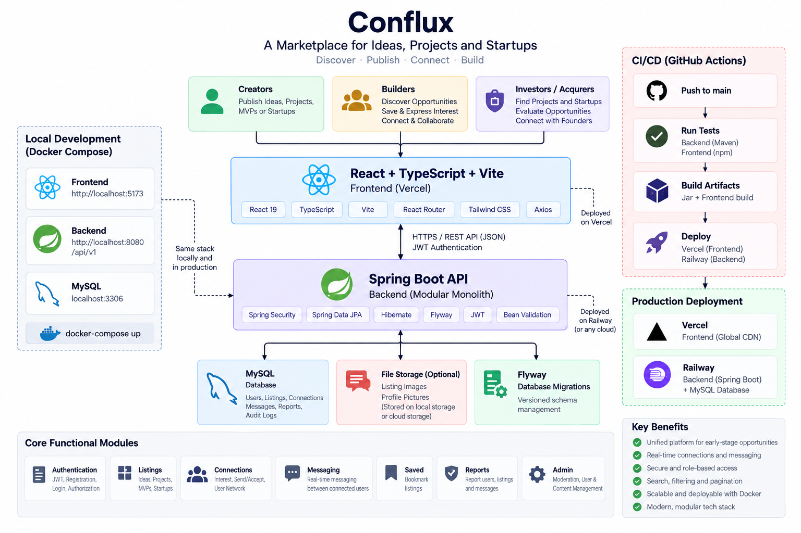

# Conflux

## A marketplace for ideas, projects, and startups

Conflux is a platform where people can **discover, publish, and connect around early-stage opportunities**.

Creators can share startup ideas, projects, MVPs, or startups they want to build, collaborate on, or sell. Other users can discover opportunities, save listings, express interest, connect with owners, and continue the conversation through messaging.

**Create → Publish → Discover → Connect → Build / Acquire**

---

## What you can do

- Publish ideas, projects, MVPs, and startups
- Browse opportunities with search, filters, sorting, and pagination
- Save listings for later
- Express interest in opportunities
- Connect with listing owners
- Message other users after a connection is accepted
- Create and manage your profile
- Report users, listings, or messages
- Manage trust and safety through an admin moderation system

---

## How it works

A listing is created as a draft and can be published by its owner.

```text
Create
  ↓
Draft
  ↓
Publish
  ↓
Discover
  ↓
View
  ↓
Save / Express Interest
  ↓
Connect
  ↓
Message
  ↓
Collaborate / Acquire
```

Published listings are available in the public marketplace. Admins handle moderation reactively rather than approving listings before publication.

---

## Architecture



### Backend modules

```text
com.conflux
├── auth
├── user
├── listing
├── connection
├── message
├── saved
├── report
├── admin
├── common
└── config
```

---

## Tech Stack

### Backend

- Java 21
- Spring Boot
- Spring Security + JWT
- Spring Data JPA / Hibernate
- Flyway
- MySQL
- Maven

### Frontend

- React
- TypeScript
- Vite
- React Router
- Axios
- Tailwind CSS

### Infrastructure

- Docker
- Docker Compose

---

## Listings

Each listing has an **asset type** and a **marketplace mode**.

### Asset types

```text
IDEA
PROJECT
MVP
STARTUP
```

### Marketplace modes

```text
COLLABORATE
ACQUIRE
```

### Listing lifecycle

```text
DRAFT → PUBLISHED → ARCHIVED
             ↓
         SUSPENDED
```

Only published listings belonging to active users are shown in the public marketplace.

---

## API

Base path:

```text
/api/v1
```

### Authentication

```text
POST /auth/register
POST /auth/login
GET  /auth/me
```

### Marketplace

```text
GET /listings
GET /listings/{slug}
```

### Listing management

```text
POST   /listings
GET    /listings/mine
GET    /listings/mine/{id}
PUT    /listings/{id}
POST   /listings/{id}/publish
DELETE /listings/{id}
```

---

## Testing

The backend and frontend include automated tests covering the main application workflows, including authentication, authorization, listing management, connections, messaging, reporting, moderation, validation, pagination, and error handling.

---

## Run Locally

### 1. Database

Create a MySQL database named:

```text
conflux
```

### 2. Backend

Create:

```text
backend/.env
```

from:

```text
backend/.env.example
```

and configure the MySQL and JWT values.

Then run:

```bash
cd backend
.\mvnw.cmd spring-boot:run
```

The backend runs on:

```text
http://localhost:8080
```

### 3. Frontend

```bash
cd frontend
npm install
npm run dev
```

The frontend runs on:

```text
http://localhost:5173
```

---

## Docker

To run the full stack with Docker Compose:

```bash
docker compose --env-file backend/.env up --build
```

This starts:

- MySQL
- Spring Boot backend
- React frontend

---

## Project Structure

```text
Conflux/
├── backend/        # Spring Boot REST API
├── frontend/       # React application
├── docker-compose.yml
└── README.md
```

---

## Status

Conflux V1 is complete and currently focused on the core marketplace workflow: **publishing opportunities, discovering them, connecting users, and enabling collaboration or acquisition**.
